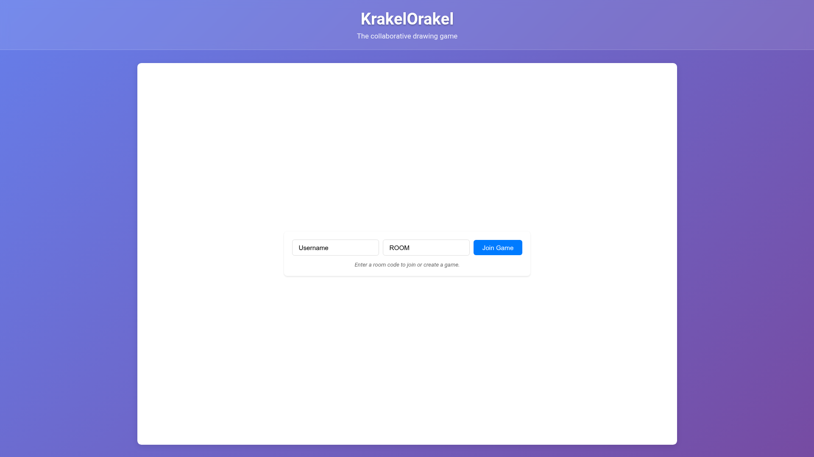
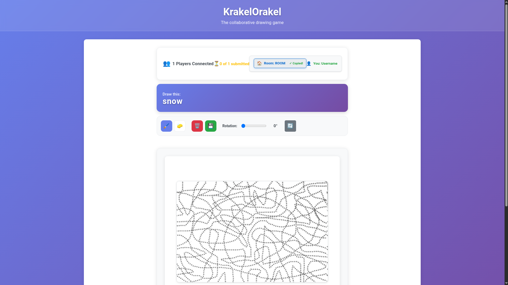
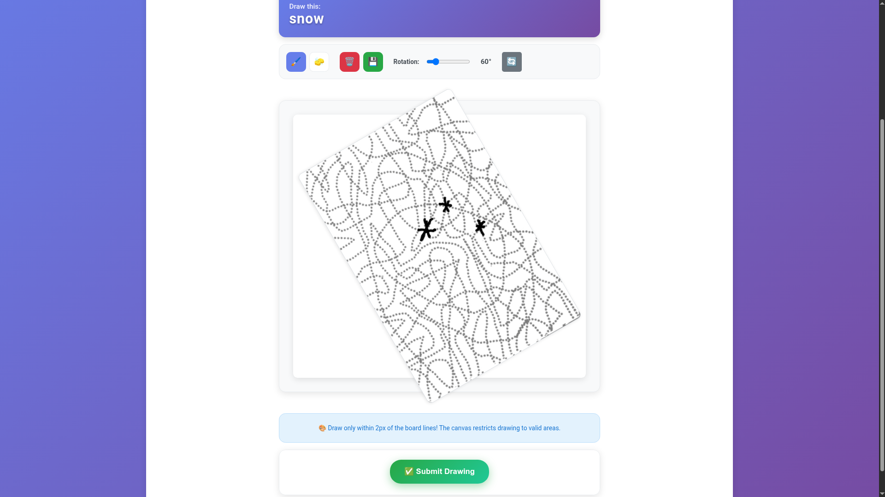
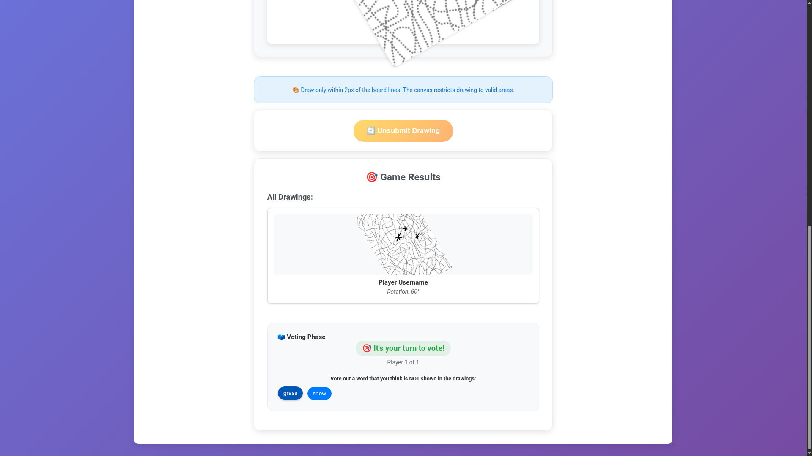
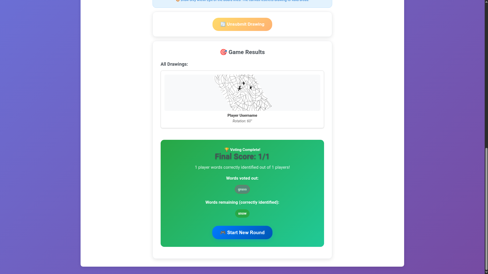

# 🎨 KrakelOrakel

[KrakelOrakel](https://de.wikipedia.org/wiki/Krakel_Orakel) is a collaborative drawing game similar to 
- [Pictionary](https://en.wikipedia.org/wiki/Pictionary#Gameplay)
- [Scribbl](https://skribbl.io/)
- [Drawception](https://drawception.com/)
- [GarticPhone](https://garticphone.com/)
- [Montagsmaler](https://de.wikipedia.org/wiki/Die_Montagsmaler)

Basically, you draw a given word and others have to guess it (more or less).
The unique aspect of KrakelOrakel is that
- it is collaborative
- you do not need to be able to draw well

## Game Rules

1. First, everyone gets a board with lines on it as well as a secret word.
1. Then, you draw the word on your board by only using the provided lines.
1. After everyone is done, the hidden words are mixed and the same amount of additional words are added.  Hence, for 8 players, there are 16 words in total.
1. The words are revealed to everyone and one after the other needs to select a word that they do not see on the drawn boards.
1. The group penalty score is how many wrong words are left in the end.
1. For a new round, the boards are cycled around to the next player and a new word is drawn.

## Game Play

1. Visit the website
1. Enter a username and room code of your choice
1. Wait for others to join, you can click on the room to get a sharable room-link (https://[URL]/?room=[CODE])
1. Once everyone joined, begin to draw (you may rotate the canvas)
1. Submit your image
1. Vote one after the other for the words

## Installation

The repository is a normal node application.
The backend runs on express, the frontend is a react application.

Locally, you can develop with `npm run dev`.
For production, the easiest way are the provided Docker containers.
Expose the frontend port 80 to access the website.